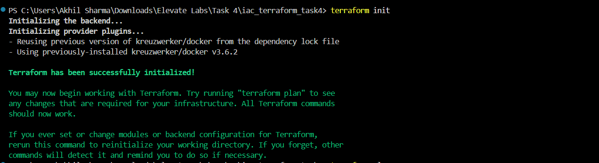
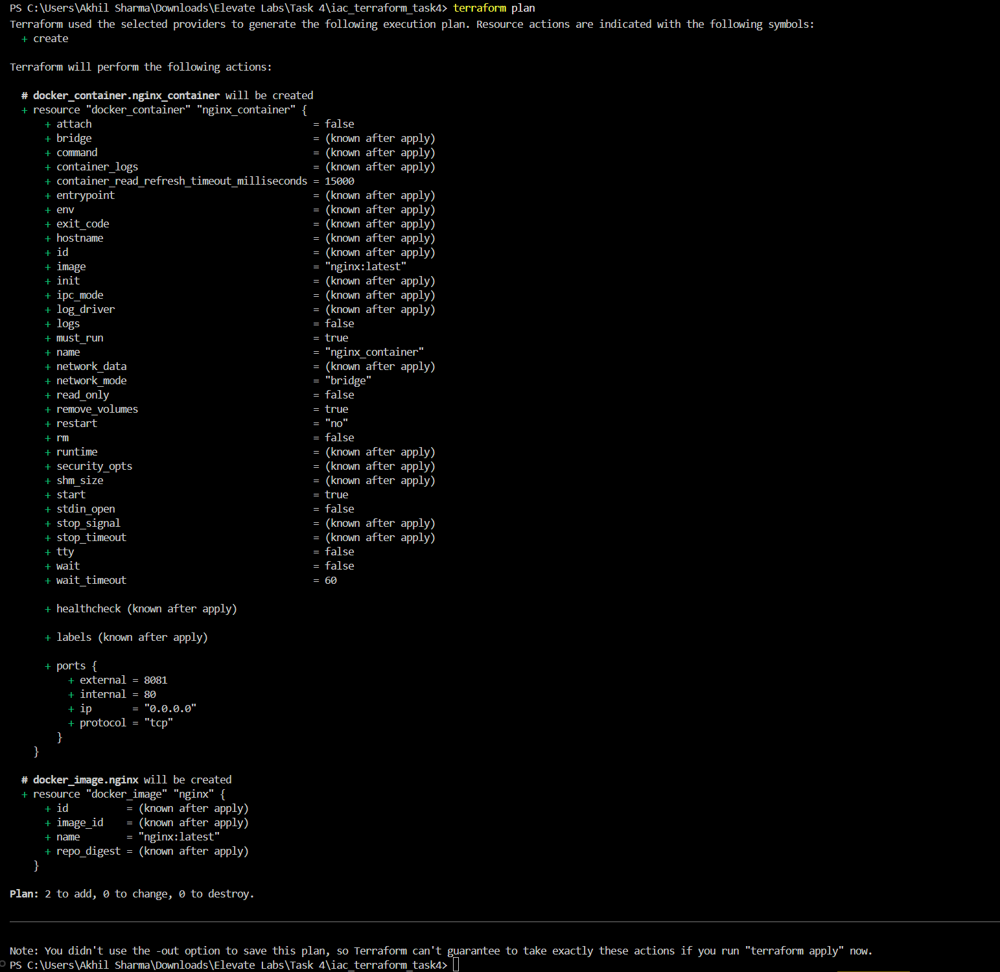
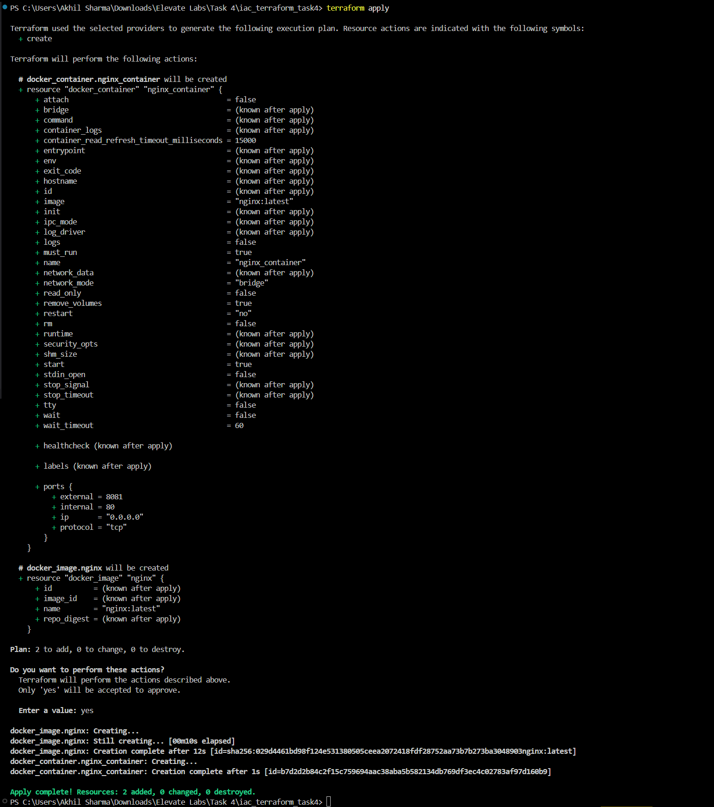
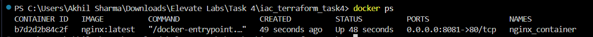
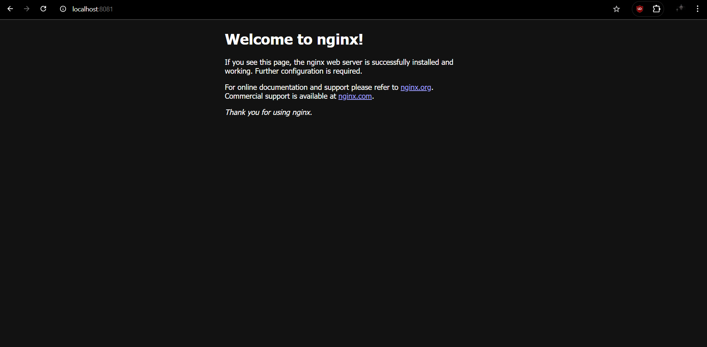

# Infrastructure as Code (IaC) with Terraform

## Objective
Provision a local Docker container using Terraform.

## Tools
- Terraform
- Docker

---

## Files
- **main.tf**: Terraform configuration to:
  - Pull the `nginx:latest` Docker image
  - Create a Docker container `nginx_container` exposing port `8081` locally

---

Go to `http://localhost:8081` to view static NGINX webpage.

---
## Screenshots

**Terraform Init**  
  

**Terraform Plan**  
  

**Terraform Apply**  
  

**Docker Container Running**  
  

**Nginx Welcome Page**  
  